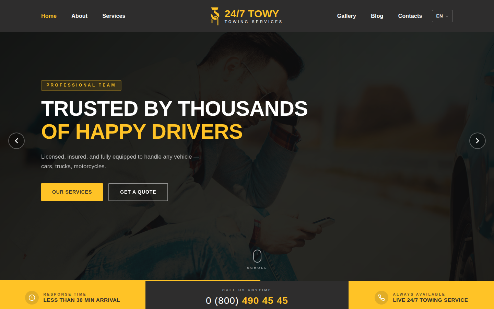
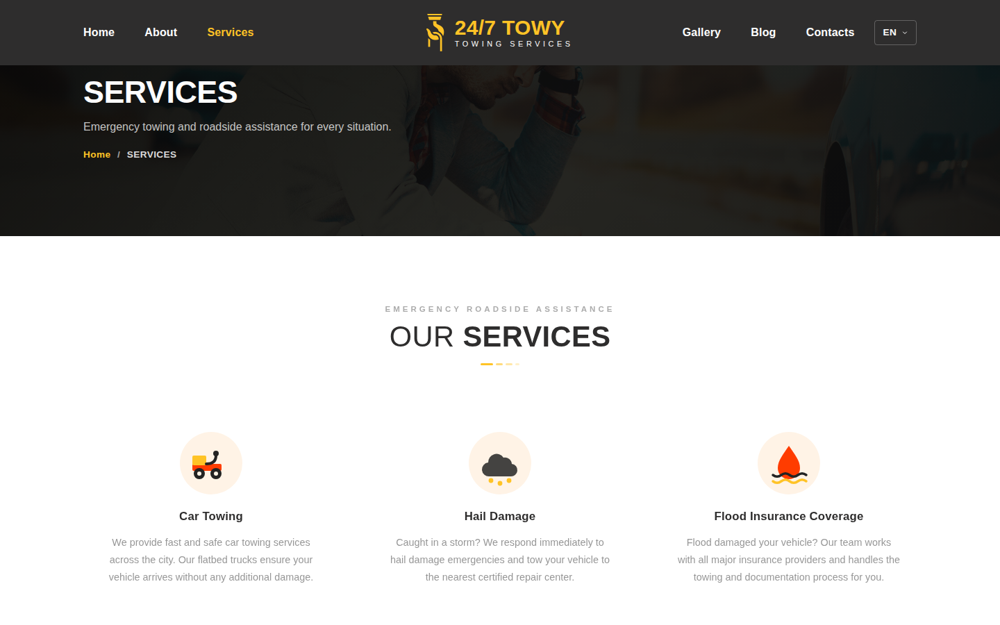
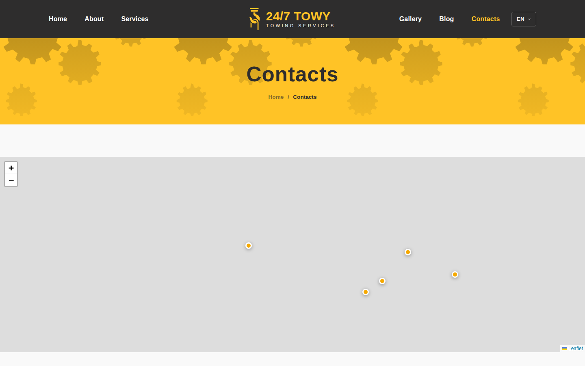
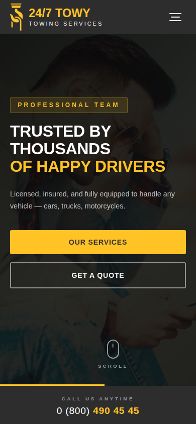

# 24/7 Towy — Towing & Roadside Assistance Website

A marketing website for a 24/7 towing and roadside assistance service: service overview, per-service detail pages, gallery, blog, and a contact page with an interactive map. Built as a single-page application with React Router, multi-language support (EN/RU/PL), and scroll animations.

## Screenshots

| Home | Services |
| --- | --- |
|  |  |

| Contacts | Home (mobile) |
| --- | --- |
|  |  |

## Tech Stack

- **React 19** (Create React App / `react-scripts`)
- **React Router v7** — client-side routing (`src/App.js`)
- **Sass/SCSS** — component-scoped stylesheets (BEM-style class naming)
- **react-i18next** — English, Russian and Polish translations (`src/i18n`)
- **AOS (Animate On Scroll)** — scroll-triggered entrance animations
- **Leaflet / react-leaflet** — the map on the Contacts page
- **@testing-library/react + Jest** — component tests (via `react-scripts test`)

## Project Structure

```
src/
  App.js               route definitions
  index.js              app bootstrap, AOS init, font loading
  i18n/                  i18next setup + en/ru/pl translation dictionaries
  pages/                 one folder per route (Home, About, Services, SingleService,
                          Gallery, Blog, Contacts, NotFound)
  components/             shared UI building blocks (Header/Footer, Hero, Services,
                          Team, Map, LanguageSwitcher, etc.)
  data/                  static structural data (e.g. service ids/images)
  hoc/                   higher-order components (ScrollTop)
  assets/                images and global Sass (variables, resets)
```

## Getting Started

**Requirements:** Node.js 18+ and npm.

```bash
npm install
npm start
```

Opens the dev server at [http://localhost:3000](http://localhost:3000) with hot reload.

### Other scripts

| Command | Description |
| --- | --- |
| `npm start` | Run the app in development mode |
| `npm run build` | Production build into `build/` |
| `npm test` | Run the Jest/React Testing Library test suite in watch mode |
| `npm run eject` | Eject from Create React App (irreversible) |

To run tests once (non-interactive, as used in CI):

```bash
CI=true npm test -- --watchAll=false
```

## Internationalization

The language switcher in the header lets visitors pick English, Russian, or Polish. The choice is detected from the browser on first visit and then persisted in `localStorage`. Translation strings live in `src/i18n/locales/{en,ru,pl}.json`.

## Deployment

The site is a static build deployable to any static host; this project is currently deployed via [Vercel](https://vercel.com). `npm run build` outputs a production bundle to `build/`. A `.npmrc` with `legacy-peer-deps=true` is checked in so `npm install` resolves peer dependencies the same way in CI/deploy environments as it does locally.

## License

See [LICENSE](./LICENSE).
